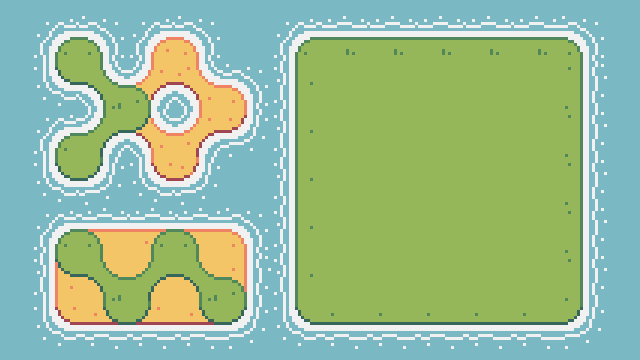
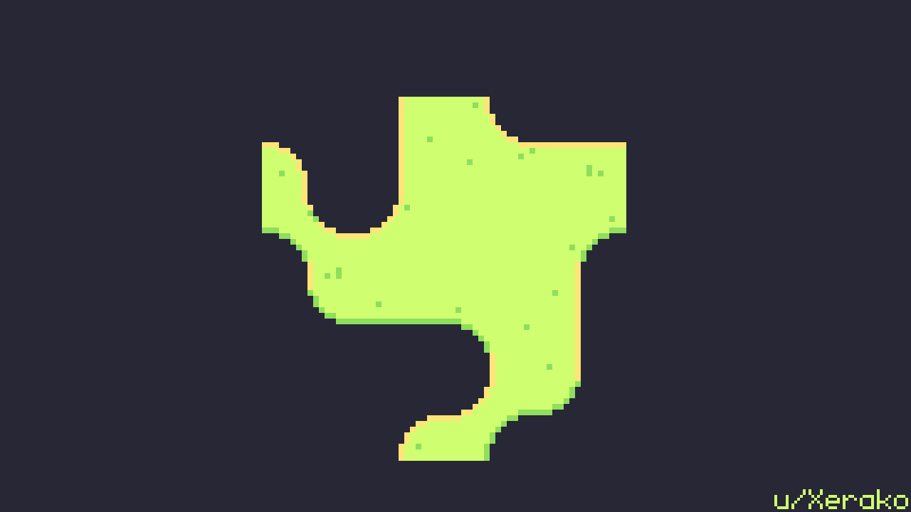
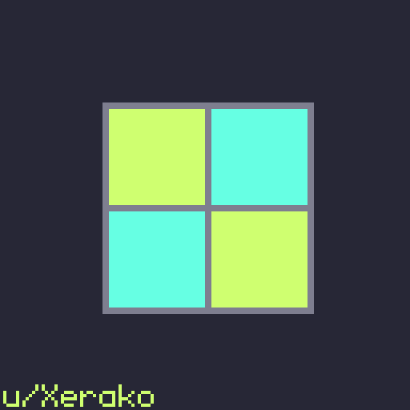

# DualGrid Bitwise Multi TileMapLayer

A multi-layered dual-grid system using a stack of TileMapLayer nodes with auto-tiling done via efficient bitwise tile-atlas indexing.

## Description

This is a demonstration of how I operate on a "Dual-Grid System" (proposed by Oskar Stalberg) that allows for inter-layer connectivity. That is to say, a layered stack of tilemaps will auto-tile together even between differing tile types (as shown in the GIF above).

My implementation uses a bitwise tile-atlas index and a cached static lookup array indexed by "bitwise neighborhoods" to quickly auto-tile display tiles.

*Visualization of generating the tile-atlas lookup array:*

This works by leveraging the fact that any given world tile on a dual-grid has exactly 3 tile neighbors, resulting in 16 possible connected tile neighbor configurations if you include the world tile performing the query. Using a 4-bit unsigned integer, we can flag any populated cell on a layer by flipping a bit then shifting those bits in accordance with an ordered neighborhood walk (i.e. always checking tile neighbors in a specific order).

*Visualization of looking up a tile using the tile-atlas lookup array:*

Using what I call "TOP" and "BOT" variants of a minimal 15-tile tileset, you can stack any number of tilemaps on top of each other and achieve this effect so long as the bottom-most tilemap is a "BOT" tileset (drawn as the inverse of a standard 15-tile minimal tileset). In this demonstration, the bottom of the stack is represented by Water tiles.

*"TOP" tileset examples: Grass and Sand*

 

*"BOT" tileset example: Water*

## Purpose

This Godot project is a precursor to the shader system project I also plan to open source. Fundamental concepts are covered here that are CPU-bound and easily played with while integrating directly with Godot's TileMapLayer nodes. My auto-tile shader system performs similar operations but on the GPU, parallelizing the entire process and leveraging per-pixel auto-tiling that isn't possible with basic sprite rendering (i.e. mixing sprites at a pixel level).

## How to Play

There is a zipped build of the game you can try in the builds folder. Controls are on the UI in the top left corner, and you can click and hold the mouse buttons to draw tiles to the screen in a "dig down" and "build up" fashion. You can close the game at any time with the Escape key.

## Versions

* Godot 4.6+ (however, this should work for any version that includes TileMapLayers)

## License

This project uses multiple licenses. See [COPYING](./COPYING.md) for details.

- **Code**: MIT License
- **Animations**: Creative Commons Attribution-NoDerivatives 4.0 International (CC BY-ND 4.0)

All source code is licensed under the **MIT License**. It's up to you if you want to attribute me (Xerako), but you're otherwise free to yoink the code and use it for your own purposes.

All animation files in [animations](./animations) are licensed under **CC BY-ND 4.0**.

## Helpful Resources

A list of resources I found helpul while implementing this project:
* [Wang tile](https://en.wikipedia.org/wiki/Wang_tile) wikipedia page
* [Introduction to Wang Tiles](https://www.boristhebrave.com/permanent/24/06/cr31/stagecast/wang/intro.html)
* [Blob Tilesets](https://www.boristhebrave.com/permanent/24/06/cr31/stagecast/wang/blob.html)
* [Draw fewer tiles - by using a Dual-Grid system!](https://youtu.be/jEWFSv3ivTg?si=EV6Wsuv-nPrvvHA8) by [jess::codes](https://www.youtube.com/@jesscodes)
* [Auto-Tiling while drawing only 5 tiles -- DUAL GRID SYSTEM](https://youtu.be/aWcCNGen0cM?si=NrOZK3Qto4Me7Eeq) by [Nonsensical 2D](https://www.youtube.com/@Nonsensical2D)
